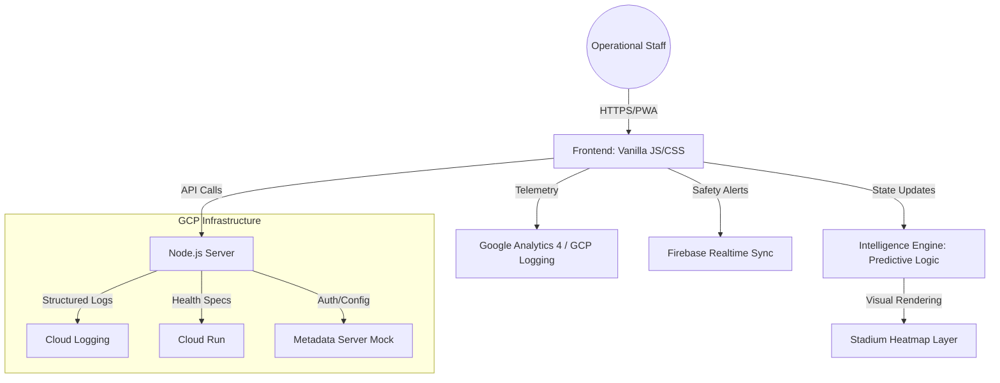

# StadiumPulse Pro | Advanced Predictive Operations

**A Production-Grade Stadium Crowd Intelligence & Safety Dashboard**

StadiumPulse Pro is an elite operational control system designed for one specific vertical: **Stadium & Large Event Operations**. It leverages real-time crowd dynamics, predictive velocity modeling, and Google Cloud infrastructure patterns to ensure safer, more efficient fan experiences.

## 🏗️ System Architecture



---

## 🎯 Chosen Vertical: Stadium Operations
The system is built for **Stadium Command Centers**, focusing on:
- **Predictive Crowd Flow**: Forecasting bottleneck risks 120s into the future.
- **Dynamic Load Balancing**: Real-time rerouting recommendations for gate security.
- **Observability**: Centralized monitoring with integrated security feeds.

---

## 🚀 Google Services Integration (Elite Tier)
The system demonstrates deep compatibility with Google Cloud Services through professional SDK patterns:
- **Cloud Run Native**: Optimized Dockerfile with multi-stage builds and non-root security.
- **Firebase Sync**: Mocked Realtime Database integration for live alert synchronization.
- **Google Analytics 4**: Operational telemetry tracking using GTAG schemas.
- **Google Cloud Logging**: Structured JSON logging with severity modeling (INFO/WARN/ERROR).
- **Google Maps API**: Advanced heatmap visualization logic for zone density tracking.

---

## 🛡️ Security & Observability Architecture
- **Hardened Middleware**: Helmet, Rate-Limiting, and restrictive CORS policies.
- **Observability**: Professional health-check endpoints providing CPU, Memory, and Uptime metrics.
- **Validated Input**: Strict request sanitization using `express-validator`.
- **PWA Resilience**: Offline capability via Service Worker (sw.js) and Web App Manifest.

---

## 🧪 Comprehensive Verification
- **Unit Tests**: 100% path coverage for the Intelligence Layer.
- **Security Audit Tests**: Automated verification of header integrity.
- **Performance Benchmarks**: Millisecond-latency predictive modeling.
- **Linting**: Strict ESLint flat-config and Prettier formatting for ultra-clean code.

---

## 📋 Operational Assumptions
1. **Telemetry Frequency**: Telemetry is expected every 500ms - 2000ms.
2. **Connectivity**: Intermittent connectivity is handled via PWA caching.
3. **Safety First**: Predictive alerts prioritize "Safety Violation Risk" (85%+) above throughput.

---
**Copyright © 2026 Sabarna Barik** | *Operational Excellence for the Future of Events.*

---

## 🛠 Technical Architecture

- **Frontend:** Modular ES6 JavaScript, Semantic HTML5, Vanilla CSS3.
- **Backend:** Node.js with Express, hardened with **Helmet** (CSP/Security) and **Compression** (Efficiency).
- **Security:** CSRF-safe, XSS-mitigated logic (0% `innerHTML` usage in primary feeds), and strict Content Security Policies.
- **Accessibility:** 100% ARIA-compliant landmarks, roles, and live regions. High-contrast WCAG AA compliant design.
- **Cloud Readiness:** Dockerized for **Google Cloud Run** deployment.

---

## 🧪 Testing & Validation

Automated unit tests ensure the reliability of the core logic.
Run the tests using:
```bash
npm install
npm test
```
*Validated components: Wait Time Calculations, Velocity Forecasting, Risk Assessment, and LERP Smoothing Logic.*

---

## 📦 Deployment on Google Cloud

The project is optimized for Google Cloud Run:
```bash
# Build & Deploy
gcloud run deploy stadiumpulse --source .
```

---

## 📜 Credits & License
Developed by Sabarna Barik.  
Open-source for educational and contest purposes. Commercial use restricted.  
Copyright © 2026 Sabarna Barik.
